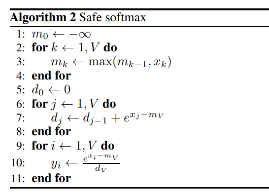
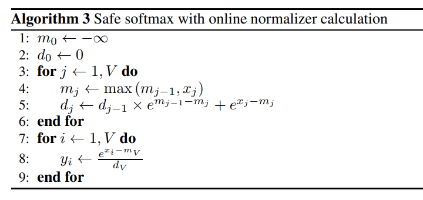
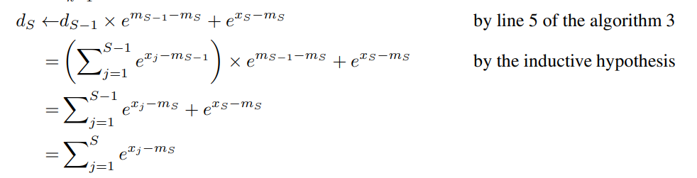

# CUDAKernels

Implement efficient operators in deep learning network with cuda.

## Element kernels

### unary ops
RELU,GELU,Sqrt,Sigmoid...

### binary ops
Add,Sub,Mul,Div...

1. 对于这种elementwise的算子，最朴素的实现方式是对每个元素开一个线程去进行计算。
2. 另一中高效的实现就是有效的利用cuda在访存过程中的合并访存(coalesced memory access)这个特性，它本质上是在一个warp内的线程访问全局内存时，会进行(32-bit)的合并访存，对于连续的32-bit的访存，只需要一次访存操作，对warp内的线程都是可见的。这样就可以减少访存的次数，提高访存的效率。
3. 还有可以通过LDG.128，STS.128来提高访存的效率。这里在llm.c中的实现过程中构造了一个Packed128的数据类型，用于打包128-bit的数据来方便进行操作。

### 实验结果
通过LDG.128并没有对带宽有很大提升，反而会降低有效带宽

## Softmax kernel

[How to write a fast softmax cuda kernel -AITemplate(facebook) ](https://github.com/facebookincubator/AITemplate/wiki/How-to-write-a-fast-Softmax-CUDA-kernel%3F)

[register cache warp cuda](https://developer.nvidia.com/blog/register-cache-warp-cuda/)

Softmax的公式如下： 
$$
Softmax(x_i) = \frac{\exp(x_i)}{\sum_{j=1}^{n}\exp{x_j}}
$$
为了保证数值的稳定性，我们可以对公式进行一些变换：
$$
Softmax(x_i) = \frac{\exp(x_i - \max(x_m))}{\sum_{j=1}^{n}\exp(x_j - \max(x_m))}
$$

在实际的计算过程中，需要首先计算max，然后减去max，然后计算exp，并求和sum，需要三次for循环，对于一个元素来说，需要3次load和
一次store，这样对访存的压力很大，所以有后面的online softmax的优化方法。

### online softmax
[online softmax paper](https://arxiv.org/pdf/1805.02867)




两者的区别在于第五步，通过数学的推导，可以在更新max的过程中计算exp。


减少一次load的操作，减少了访存的压力，提高了计算的效率。


### cuda kernel 实现


## layer normalization kernel
[layernorm](https://arxiv.org/pdf/1607.06450.pdf)

layer norm 对每一次的输入进行归一化，然后进行线性变换，公式如下：
$$
y = \gamma \frac{x - \mu}{\sqrt{\sigma^2 + \epsilon}} + \beta
$$
其中$\mu$是均值，$\sigma$是方差，$\gamma$和$\beta$是可学习的参数，$\epsilon$是一个很小的数，用于防止分母为0。
输入是B,T,C的tensor，对于每一个C的channel，计算均值和方差，然后对每一个元素进行归一化。

### kernel实现
对于每一个channel，计算均值和方差，然后对每一个元素进行归一化。
需要计算一次均值和方差，先计算均值，然后计算方差，然后对每一个元素进行归一化。
或者通过方差的公式，可以直接计算方差。
计算均值和方差就是传统的reduce操作，可以通过不同level的Reduce来实现。

## self-attention kernel
[self-attention paper](https://arxiv.org/pdf/1706.03762.pdf)

self-attention是transformer的核心组件，通过计算query,key,value的**内积**，然后通过softmax得到attention的权重，然后对value进行**内积**，得到最终的输出。

$$
Attention = softmax(\frac{QK^T}{\sqrt{d_k}})V
$$

其中
Q : [B, T, D_K]
K : [B, T, D_K]
V : [B, T, D_V]


```python
# Self Attention
import torch
import torch.nn
from math import sqrt

class SelfAttention(nn.Module):
    # input : B * T * D
    # Q     : B * D * D_K
    # K     : B * D * D_K
    # V     : B * D * D_V
    def __init(self, input_dim, dim_k, dim_v):
        super(SelfAttention, self).__init__()
        self.Q = nn.Linear(input_dim, dim_k)
        self.K = nn.Linear(input_dim, dim_k)
        self.V = nn.Linear(input_dim, dim_v)
        self._norm_factor = 1.0 / sqrt(dim_k)
    
    def forward(self, x):
        q = self.Q(x) # B * T * D_K
        k = self.K(x) # B * T * D_K
        v = self.V(x) # B * T * D_V
        
        attention = torch.bmm(q, k.permute(0, 2, 1)) # B * T * T
        attention = nn.Softmax(dim=-1)(attention) * self._norm_factor # B * T * T

        output = torch.bmm(attention, v) # B * T * D_V

        return output

# Multi-head Attention
class MultiHeadAttention(nn.Module):
    # input : B * T * D
    # Q     : B * D * D_K  // num_heads
    # K     : B * D * D_K // num_heads
    # V     : B * D * D_V // num_heads
    def __init__(self, input_dim, dim_k, dim_v, num_heads):
        super(MultiHeadAttention, self).__init__()
        self.Q = nn.Linear(input_dim, dim_k)
        self.K = nn.Linear(input_dim, dim_k)
        self.V = nn.Linear(input_dim, dim_v)
        self.head_size = dim_k // num_heads
        self.num_heads = num_heads
        self.dim_k = dim_k
        self.dim_v = dim_v
        self._norm_factor = 1.0 / sqrt(head_size)

    def forward(self, x):
        q = self.Q(x).view(B, T, num_heads, dim_k // self.num_heads).permute(0, 2, 1, 3) #[B, num_heads, T, D_K]
        k = self.K(x).view(B, T, num_heads, dim_k // self.num_heads).permute(0, 2, 1, 3) #[B, num_heads, T, D_K]
        v = self.V(x).view(B, T, num_heads, dim_v // self.num_heads).permute(0, 2, 1, 3) #[B, num_heads, T, D_K]

        attention = torch.bmm(q, k.permute(-1, -2)) # [B, num_heads, T, T]
        attention = nn.Softmax(dim=-1)(attention) * self._norm_factor # B * num_heads * T * T

        output = torch.bmm(attention, v) # B * num_heads * T * head_size
        output = output.view(B, T, dim_v) # B * T * D_V

        return output


```

## Flash Attention


一些参考学习的链接:
[[Attention优化][2w字]🔥原理&图解: 从Online-Softmax到FlashAttention V1/V2/V3](https://www.cvmart.net/community/detail/14806)
