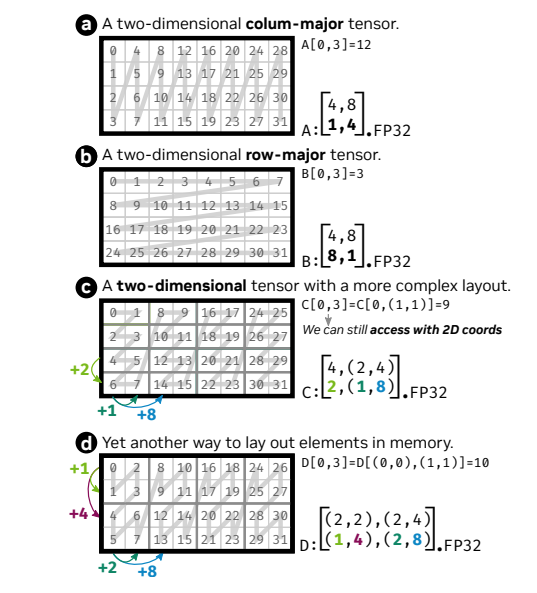

# Cutlass 学习笔记
Cutlass2.x和Cutlass3.x之间的差距比较大。Cutlass2.x的抽象层次还是按照GPU的层次结构去进行的，这对一些新架构的出现并灵活，比如Hopper的warp-group wide instructions等。Cutlass3.x将接口层次从硬件中分离出来，而是围绕GEMM算法的自然结构进行中心化，不再与特定的GPU架构绑定。这使得Cutlass的代码更加健壮，不容易受到GPU架构的演变的影响，不容易泄漏实现细节，提供了一致的硬件加速接口，不受架构特定细节的影响。

那么如何选择Cutlass2.x和Cutlass3.x呢？
按照[b站视频](https://www.bilibili.com/video/BV1XH4y1c7JZ/?spm_id_from=333.337.search-card.all.click&vd_source=d1924c1c28185d30b1882862364d1aa8)中讲解的，如果你是在Hopper及以后架构上使用建议使用Cutlass3.x，如果你是在Ampere及以前架构上使用建议使用Cutlass2.x。

## Cute 学习笔记
Cute是Cutlass3.x中引入的一个核心库，用于描述和操作线程和数据的张量。Cute是一个C++ CUDA模板抽象的集合，用于定义和操作线程和数据的层次多维布局。Cute提供了`Layout`和`Tensor`对象，这些对象紧凑地封装了数据的类型、形状、内存空间和布局，同时为用户执行复杂的索引。Cute中包含了对GEMM层次结构的描述和操作，大大简化了设计，提高了代码的可组合性和可读性。
### Cute的Layout
数据在计算机中的排布通常是一维的，高维矩阵的逻辑坐标都是通过转换到具体的物理索引，对于复杂的数学问题，数据的排布可能更复杂，所以Cute中引入了有层次的Layout来描述数据计算空间和一维地址空间的映射问题。它是通过Shape和Strides来构造的，Shape描述排列的分块层次和结构，Stride描述块内或块间的数据排列连续性，Shape和Stride都是层级的嵌套表示，但同时两者的嵌套层级也必须一一对应。
Shape通过make_shape()这个静态函数来构造，Stride通过make_stride()这个静态函数来构造。
这两个函数都支持变量/常量构造。

[图来自论文](https://dl.acm.org/doi/pdf/10.1145/3582016.3582018)

图中a,b都是一层次的嵌套，c,d都是两层次的嵌套，这个嵌套层次后面也叫做秩Rank。

a图中，是一个二维的列主序的Tensor，Shape是(4, 8)，Stride是(1, 4)。
其中4表示行的个数，8表示列的个数，Stride中的1表示行的步长，即行之间相邻的两个元素其物理地址的距离；4表示列的步长，即列之间相邻的两个元素其物理地址的距离。

c图中是一个二维的复杂的Tensor，Shape是(4, (2, 4)), Stride是(2, (1, 8))。
其中4是行的个数，(2, 4)是对列的描述，2是内部列的个数，4是外部列的个数。Stride中的2表示行的步长，即行之间相邻的两个元素其物理地址的距离；(1, 8)表示列的步长，1是内部列之间相邻的两个元素其物理地址的距离，8是外部列之间相邻的两个元素其物理地址的距离。

d图的分析方法同理。

```cpp
    using namespace cute;
    auto inner_shape1 = make_shape(2, 2);
    auto inner_shape2 = make_shape(2, 4);
    auto shape = make_shape(inner_shape1, inner_shape2);
    auto inner_strides1 = make_shape(1, 4);
    auto inner_strides2 = make_shape(2, 8);
    auto strides = make_shape(inner_strides1, inner_strides2);
    auto layout = make_layout(shape, strides);
    print(" Layout : ");     // print是Cute提供的一个通用的打印函数，可以在CPU，GPU上使用
    print(layout);
//output: Layout : ((2,2),(2,4)):((1,4),(2,8))
```
如果要分析一个Layout的结构，可以通过print_latex来打印Layout的形状和对应的物理地址的关系。
或者可以手动的通过坐标来获取layout中每个位置的物理地址，同时layout也接受1D的坐标访问:
```cpp
print_latex(layout);
// 下面是通过坐标来获取layout中每个位置的物理地址
template <class Shape, class Stride>
void print2D(Layout<Shape,Stride> const& layout)
{
  for (int m = 0; m < size<0>(layout); ++m) {
    for (int n = 0; n < size<1>(layout); ++n) {
      printf("%3d  ", layout(m,n));
    }
    printf("\n");
  }
}
// 下面是通过1D坐标来获取layout中每个位置的物理地址
template <class Shape, class Stride>
void print1D(Layout<Shape,Stride> const& layout)
{
  for (int i = 0; i < size(layout); ++i) {
    printf("%3d  ", layout(i));
  }
}
```
一个Layout的有三种坐标空间：
1. 1-D坐标空间，即一个一维的坐标空间。
2. R-D坐标空间，即按照Layout的秩Rank来描述的坐标空间。
3. h-D坐标空间，即按照Shape的各个维度来描述的坐标空间。
Layout是一种函数。

### Cute的Tensor
Cute中的Tensor是一个对数据排布描述的函数，而不是一个真正包含数据的对象(如Pytorch中的Tensor)。Cute中的Tensor = Layout+Storage，Layout如上所述，Storage是一个指向数据的指针，在GPU上它可以使GM，SM，或者RG的指针。Cute中Tensor的变换也多是对数据排布的变换，而不是对数据本身的变换，通常只是对Layout的变换。
1. 构造Tensor
Tensor分为两种，一种是持有式的Tensor，在构造的时候会进行内存的拷贝，析构的时候会释放内存。
另一种是引用式的Tensor，只是引用了数据的指针，不会进行内存的拷贝和释放。
Nonowning Tensors(引用式Tensor)：通过传入一个迭代器和一个Layout来构造一个Tensor，这个迭代器可以是原始的指针，也可以是一个通过make_smem_ptr()或者make_gmem_ptr()构造的指针。
Owning Tensors(持有式Tensor):通过make_tensor<T>(Layout)来构造，T是具体的数据类型，Layout是数据的排布。
##注意##这里的Layout的Shape和Strides必须是静态的，也就是必须在编译期就确定。
```cpp
float* A = ...;
// Nonowning Tensors
// Untagged pointers
Tensor tensor_8   = make_tensor(A, make_layout(Int<8>{}));  // Construct with Layout
Tensor tensor_8s  = make_tensor(A, Int<8>{});               // Construct with Shape
Tensor tensor_8d2 = make_tensor(A, 8, 2);                   // Construct with Shape and Stride

// Global memory (static or dynamic layouts)
Tensor gmem_8s     = make_tensor(make_gmem_ptr(A), Int<8>{});
Tensor gmem_8d     = make_tensor(make_gmem_ptr(A), 8);
Tensor gmem_8sx16d = make_tensor(make_gmem_ptr(A), make_shape(Int<8>{},16));
Tensor gmem_8dx16s = make_tensor(make_gmem_ptr(A), make_shape (      8  ,Int<16>{}),
                                                   make_stride(Int<16>{},Int< 1>{}));

// Shared memory (static or dynamic layouts)
Layout smem_layout = make_layout(make_shape(Int<4>{},Int<8>{}));
__shared__ float smem[decltype(cosize(smem_layout))::value];   // (static-only allocation)
Tensor smem_4x8_col = make_tensor(make_smem_ptr(smem), smem_layout);
Tensor smem_4x8_row = make_tensor(make_smem_ptr(smem), shape(smem_layout), LayoutRight{});

// Owning Tensors
// Register memory (static layouts only)
Tensor rmem_4x8_col = make_tensor<float>(Shape<_4,_8>{});
Tensor rmem_4x8_row = make_tensor<float>(Shape<_4,_8>{},
                                         LayoutRight{});
Tensor rmem_4x8_pad = make_tensor<float>(Shape <_4, _8>{},
                                         Stride<_32,_2>{});
Tensor rmem_4x8_like = make_tensor_like(rmem_4x8_pad);
```
2. Access Tensor
   
```cpp
template <class Coord>
decltype(auto) operator[](Coord const& coord) {
  return data()[layout()(coord)];
}
```
Tensor可以通过[]或者()来进行访问，可以通过坐标来访问Tensor中的数据，需要通过make_coord()来构造坐标或者传入一个逻辑位置。

3. Tilling Tensor
通过对Layout的变换来实现对Tensor的切片。

4. Slicing  a Tensor
是对Tensor的切片访问，即对Tensor的某一维度进行切片访问。通过_来表示切片，通过make_coord()来构造切片的坐标。
```cpp
// ((_3,2),(2,_5,_2)):((4,1),(_2,13,100))
Tensor A = make_tensor(ptr, make_shape (make_shape (Int<3>{},2), make_shape (       2,Int<5>{},Int<2>{})),
                            make_stride(make_stride(       4,1), make_stride(Int<2>{},      13,     100)));

// ((2,_5,_2)):((_2,13,100))
Tensor B = A(2,_);

// ((_3,_2)):((4,1))
Tensor C = A(_,5);

// (_3,2):(4,1)
Tensor D = A(make_coord(_,_),5);

// (_3,_5):(4,13)
Tensor E = A(make_coord(_,1),make_coord(0,_,1));

// (2,2,_2):(1,_2,100)
Tensor F = A(make_coord(2,_),make_coord(_,3,_));
```

5. Partitioning a Tensor
inner_partition
outer_partition
local_tile()


### Cute的Copy

### Cute的MMA

### Cute的Gemm