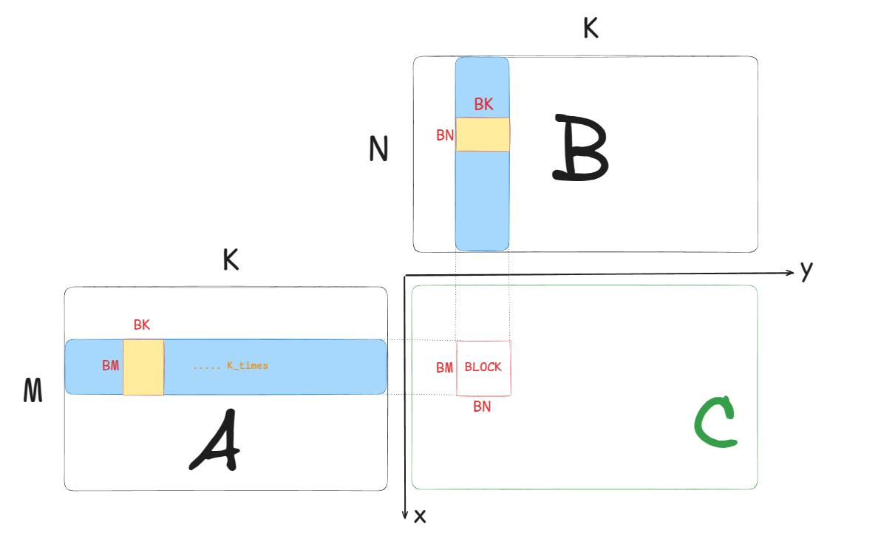

# CUDA GEMM 从入门到cutlass
GEMM(General Matrix Multiply)是深度学习中最常用的操作之一，是矩阵乘法的一种特殊形式。在深度学习中，GEMM操作通常用于计算神经网络的前向和反向传播。在CUDA中，GEMM操作通常使用cuBLAS库来实现，cuBLAS库是NVIDIA提供的一个高性能的线性代数库。cuBLAS库提供了一系列的API，可以用来实现矩阵乘法、矩阵向量乘法、矩阵转置等操作。cuBLAS库的API非常简单，只需要调用几个API就可以实现矩阵乘法操作。

下面我们来进行GEMM的通用优化。(我们约定A为MxK的矩阵，B为KxN的矩阵，C为MxN的矩阵，同时约定A、B、C的存储顺序为行优先存储)

## 1. 传统的GEMM实现
传统的GEMM实现是通过三层循环来实现的，如下所示：
```cpp
template <int M, int N, int K>
void gemm_cpu(const float* A, const float* B, float* C)
{
    for (int i = 0; i < M; i++)
    {
        for (int j = 0; j < N; j++)
        {
            float sum = 0;
            for (int k = 0; k < K; k++)
            {
                sum += A[i * K + k] * B[k * N + j];
            }
            C[i * N + j] = sum;
        }
    }
}
```
## 2. 简单的CUDA实现
将CPU版本的代码转换为CUDA版本，我们用一个线程计算一个元素，如下图所示：

我们对整个C矩阵需要进行BLOCK的划分，BLOCK中每一个线程计算C矩阵中的一个元素。
```cpp
template <int M, int N, int K>
__global__ void gemm_kernel1(const float* A, const float* B, float* C)
{
    int i = blockIdx.x * blockDim.x + threadIdx.x; // 计算C的行索引
    int j = blockIdx.y * blockDim.y + threadIdx.y; // 计算C的列索引
    if (i < M && j < N)
    {
        float sum = 0;
        for (int k = 0; k < K; k++)
        {
            sum += A[i * K + k] * B[k * N + j]; // 计算C[i][j]的值
        }
        C[i * N + j] = sum;
    }
}
```
## 3. 使用共享内存(Block Level Optimize)
可以发现，在计算C[i][j]的时候，A[i][k]和B[k][j]的值会被多次读取，我们可以将这些值存储在共享内存(Shared Memory，后面都称Smem)中，以减少全局内存的访问次数。这里就有两个问题，如何将这些值存在Smem中，以及如何使用这些值。先说一下关于Smem的一些基本的概念，Smem是一个高速硬件资源，它的大小是有限的(它和L1 cache是同一片区域，可以手动划分设置)，不同型号的GPU的大小不一致，在同一个BLOCK中是共享的。
既然Smem是在一个BLOCK中共享的，那是否可以将这个BLOCK中所有线程计算C矩阵时访问的A，B的值都存储在Smem中呢？
当然可以。在上一个实现中，假设一个BLCOK的大小是BM * BN，那么每个线程访问A矩阵一行，B矩阵一列，整个块对全局内存的读取的次数就是 2 * BM * BN * K; 如果我们将A矩阵的一行和B矩阵的一列存储在Smem中，那么对全局内存的读取次数就是 BM * K + BN * K，这样就减少了读取全局内存的次数。这样我们在每个线程计算前，可以现将这个BLOCK需要的访问的A，B的值存储在Smem中，然后再计算C矩阵的值。但是这样会有一个问题，就是Smem的大小是有限的，如果K是一个很大的值，就有可能超过Smem的大小导致编译不通过。所以我们可以再对K维度进行一次划分，对于一个BLOCK多次去计算C矩阵的值，这样就可以减少Smem的使用。这种方法是Splite K的方法。

```cpp
template <int M, int N, int K, int BM, int BN, int BK>
__global__ void gemm_kernel2(const float* A, const float* B, float* C)
{
    __shared__ float As[BM][BK];
    __shared__ float Bs[BK][BN];
    int bx = blockIdx.x;
    int by = blockIdx.y;
    int tx = threadIdx.x;
    int ty = threadIdx.y;
    int i = bx * BM + tx;
    int j = by * BN + ty;
    int tiles = K / BK;
    for (int tile = 0; tile < tiles; tile++)
    {
        if (tx < BK && ty < BM)
        {
            As[tx][ty] = A[i * K + tile * BK + ty];
            Bs[tx][ty] = B[(tile * BK + tx) * N + j];
        }
        __syncthreads();
        float sum = 0;
        for (int kk = 0; kk < BK; kk++)
        {
            sum += As[tx][kk] * Bs[kk][ty];
        }
        C[i * N + j] += sum;
        __syncthreads();
    }
}
```
### 3.1 Thread coarsening 和 Transpose
所以简单来说，我们每次就是用BM * BN这么大的BLOCK(线程块)去分别加载A矩阵的BM * BK，和B矩阵的BK * BN的值。
实际上我们可以让每个线程多加载一些数据进来，提高读的带宽。具体的做法就是通过LDGS.128这个指令一次多读几个数据进来(具体根据数据类型来判断，我们使用的是float，所以让每个线程一次性加载4个数据是最好的，这时候blockDim.x，blockDim.y就和BM，BN不相等了)。同时提高每个线程的计算量，这样可以提高计算的效率。
同时还可以注意到上面在访问As和Bs的时候，我们是按照As[tx][kk]和Bs[kk][ty]的方式来访问的，这样访问的时候是不连续的，这样会导致访存的效率不高。我们可以将Bs转置，这样访问Bs[ty][kk]的时候就是连续的了，可以提高缓存的命中率。
```cpp
#define FLOAT4(value) (reinterpret_cast<float4*>(&(value))[0])
template <int BM, int BN, int BK, int TM, int TN>
__global__ void gemm_kernel3(float* A, float* B, float* C, int M, int N, int K)
{
    int tx = threadIdx.x;
    int ty = threadIdx.y;
    int bx = blockIdx.x;
    int by = blockIdx.y;
    int tid = ty * blockDim.x + tx;

    int load_smem_a_m = tid / (BM / TM);
    int load_smem_a_k = (tid % (BM / TM)) * TM;
    int load_smem_b_k = tid / (BN / TN);
    int load_smem_b_n = (tid % (BN / TN)) * TN;

    int load_gmem_a_m = by * BM + load_gmem_a_m;
    int load_gmem_b_n = bx * BN + load_gmem_b_n;
    if (load_gmem_a_m >= M || load_gmem_b_n >= N)
    {
        return;
    }
    __shared__ float As[BM][BK];
    __shared__ float Bs[BK][BN];

    float r_c[TM][TN] = {0}; // 当前线程负责计算的8x8的结果，通过寄存器存储
    for (int tile = 0; tile < K; tile += BK)
    {
        // 加载A和B的数据到共享内存中
        FLOAT4(As[load_smem_a_m][load_smem_a_k]) = FLOAT4(A[load_gmem_a_m * K + tile + load_smem_a_k]);
        FLOAT4(Bs[load_smem_b_k][load_smem_b_n]) = FLOAT4(B[(tile + load_smem_b_k) * N + load_gmem_b_n]);
        __syncthreads();
        // 计算C的一个8x8的子块
        for (int k = 0; k < BK; k++)
        {
            for (int m = 0; m < TM; m++)
            {
                for (int n = 0; n < TN; n++)
                {
                    int smem_a_m = tx * TM + m;
                    int smem_b_n = ty * TN + n;
                    r_c[m][n] += As[smem_a_m][k] * Bs[k][smem_b_n];
                }
            }
        }
        __syncthreads();
    }
#pragma unroll
    for (int m = 0; m < TM; m++)
    {
        for (int n = 0; n < TN; n += 4) // FLOAT4
        {
            int gmem_c_m = by * BM + ty * TM + m;
            int gmem_c_n = bx * BN + tx * TN + n;
            int gemm_c_addr = gmem_c_m * N + gmem_c_n;
            FLOAT4(C[gemm_c_addr]) = FLOAT4(r_c[m][n]);
        }
    }
}
```
## 4. Bank Conflict (TODO)

## 5. Double Buffer
 


随着NVIDIA显卡的不断更新，对于GEMM的计算支持也在不断更新。所以不同版本的GPU会有不同的优化方法，比如从Volta架构开始，NVIDIA引入了Tensor Core，可以用来加速矩阵乘法的计算。在这里我们不讨论Tensor Core的使用，下面我们来看看如何使用Tensor Core来加速GEMM的计算。

## 6. 使用Tensor Core加速GEMM计算

## 7. Cutlass 终极武器
